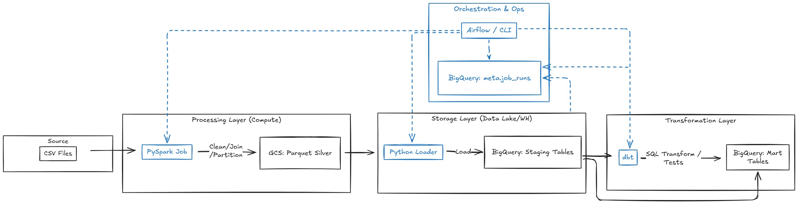
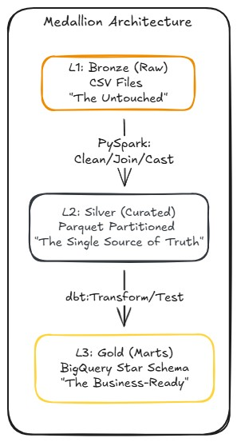

# Olist End-to-End Data Engineering Pipeline


A production-ready data engineering solution demonstrating **Medallion Architecture** principles. Built with a modern data stack to handle complex E-commerce data transformation and analytics.

---

## Architecture Overview


_High-level overview of the data flow and orchestration logic_

### The Medallion Approach


_Refining raw data into business-ready analytics tables_

| Stage             | Technology | Description                                                                        |
| ----------------- | ---------- | ---------------------------------------------------------------------------------- |
| **Ingestion**     | PySpark    | Reads raw CSV, applies explicit schema validation, and outputs partitioned Parquet |
| **Storage**       | GCS        | Scalable cloud storage for Parquet files (Silver Layer)                            |
| **Warehouse**     | BigQuery   | Curated Silver layer and optimized Gold layer marts                                |
| **Modeling**      | dbt-core   | Transformation logic, data quality testing, and documentation                      |
| **Orchestration** | Airflow    | Automated, idempotent workflow management with Astro CLI                           |

---

## Engineering Highlights

### 1. Data Transformation (PySpark)

I implemented a robust transformation layer using PySpark to handle ingestion. By using **Explicit StructType schemas** instead of `inferSchema`, I ensured the pipeline's stability against unexpected data format changes.

**Key Features:**

- **Partitioned Output**: Parquet files are partitioned by year and month to optimize downstream query costs in BigQuery
- **Snappy Compression**: Balanced storage efficiency and read performance
- **Schema Contract**: Pipeline fails fast on schema violations, preventing corrupted data

---

### 2. Analytics Modeling (dbt)


_Automated lineage showing dependencies from source to marts_

#### Solving "The Olist Trap"

> **Critical Discovery:** I identified that `customer_id` is unique per order, not per person. To calculate accurate Lifetime Value (LTV), my model aggregates data using `customer_unique_id`.

```sql
-- WRONG: Groups by order, not person
GROUP BY customer_id  --

-- CORRECT: Accurate Lifetime Value calculation
GROUP BY customer_unique_id  --
```

#### Advanced Optimization in Gold Layer


_Evidence of Technical Optimization: Incremental Load, Clustering, and Partitioning_

| Model                   | Rows  | Optimization                            |
| ----------------------- | ----- | --------------------------------------- |
| `fct_sales_performance` | 112k+ | Incremental + Clustering + Partitioning |
| `dim_customers_metrics` | -     | Customer LTV, tenure, order frequency   |

**Optimization Techniques:**

- **Incremental Strategy**: Only processes new data, significantly reducing computation costs
- **Clustering**: Clustered by `customer_unique_id` to speed up customer-level analytical queries
- **Partitioning**: Partitioned by `purchased_at` to prune unnecessary data scans

---

### 3. Operational Excellence (Observability)

I developed a custom `JobLogger` class to ensure every run is audited. The metadata is captured in the `meta.job_runs` table within BigQuery for full pipeline observability.

**Example Log Entry:**

| job_id        | step_name             | status  | rows_processed | duration_sec |
| ------------- | --------------------- | ------- | -------------- | ------------ |
| 20260116_0200 | silver_transformation | SUCCESS | 112,650        | 45.2         |

---

### 4. Orchestration (Airflow)


_A successful end-to-end pipeline run on Airflow_

The entire workflow is managed by Apache Airflow, featuring:

- **Schedule**: Daily at 02:00 AM (`0 2 * * *`)
- **Retries**: 2 attempts with 5-minute delay
- **Idempotency**: The DAG is designed to be re-run safely without creating duplicate data
- **Auto Documentation**: The pipeline automatically refreshes dbt documentation upon successful transformation

---

## Challenges & Solutions

### Challenge 1: Schema Stability & Data Integrity

**Problem:** Inconsistent data types in raw CSVs often break downstream models.

**Solution:** I established a "Schema Contract" in the PySpark layer. By failing fast on schema violations, I prevent corrupted data from entering the warehouse.

---

### Challenge 2: Resource Optimization

**Problem:** Managing a multi-stage pipeline under budget constraints.

**Solution:** I utilized a **Serverless-first** approach on GCP:

| Strategy       | Implementation               | Impact               |
| -------------- | ---------------------------- | -------------------- |
| Staging Models | `materialized='view'`        | $0 storage           |
| Fact Tables    | `incremental` + `unique_key` | ~90% scan reduction  |
| Partitioning   | `order_purchase_timestamp`   | Query pruning        |
| Location       | `us-central1`                | Always Free eligible |

**Result:** Entire pipeline operates within GCP's Always Free tier.

---

### Challenge 3: Customer Identity Resolution (The Olist Trap)

**Problem:** The Olist dataset uses two different customer identifiers, leading to incorrect LTV calculations.

**Solution:** Documented and solved "The Olist Trap" by identifying `customer_unique_id` as the true person identifier.

---

## Project Structure

```
olist-pipeline/
├── spark/         # PySpark processing logic
├── ingest/        # BigQuery loader
├── utils/         # JobLogger & Cloud helpers
├── dbt_olist/     # dbt transformation & tests
├── airflow/       # Orchestration workflows (Astro CLI)
├── config/        # Pipeline configuration
└── Makefile       # CLI Automation for development
```

---

## Quick Start

### Prerequisites

- Python 3.10+
- Java 17 (for PySpark)
- Docker Desktop (for Airflow)
- GCP Service Account with BigQuery + GCS permissions

### Installation

```bash
# Clone repository
git clone https://github.com/anupat2046/olist-pipeline.git
cd olist-pipeline

# Install dependencies
make setup

# Run complete pipeline
make all
```

### Individual Steps

```bash
make silver     # Spark → GCS → BigQuery (Silver)
make dbt-all    # dbt run + test (Gold)
make dbt-docs   # Generate documentation
```

---

## Next Steps: From Data Engineering to Business Insights

This pipeline is engineered for immediate scalability. The logical progression is to transform the refined Gold Layer data into **Actionable Insights** through advanced visualization.

### Connecting to Looker Studio

With the modeled data residing in BigQuery (Gold Marts), it is primed for native integration with Looker Studio:

- **LTV Dashboard**: Leverage the `dim_customers_metrics` table to perform customer segmentation and identify high-value individuals based on their Lifetime Value
- **Sales Performance**: Monitor monthly Net Revenue trends. By utilizing the table's Partitioning, dashboard performance remains high while BigQuery scan costs remain low

### Value Proposition

This project is more than a data transfer exercise; it provides a robust foundation for downstream **Data Science and Analytics teams**, allowing them to focus on insights rather than redundant data cleaning.

---

## Author

**Anupat Suttilert** - 3rd-year Data Science Student at Thammasat University & Aspiring Data Engineer

[](https://www.linkedin.com/in/anupat-suttilert-888a73348)
[](https://github.com/anupat2046)

- Passionate about scalable data architecture and cloud optimization
- Stack: Python, SQL, PySpark, dbt, Airflow, GCP

---

## License

This project is for educational and portfolio purposes. Dataset sourced from [Kaggle - Brazilian E-Commerce](https://www.kaggle.com/datasets/olistbr/brazilian-ecommerce).
